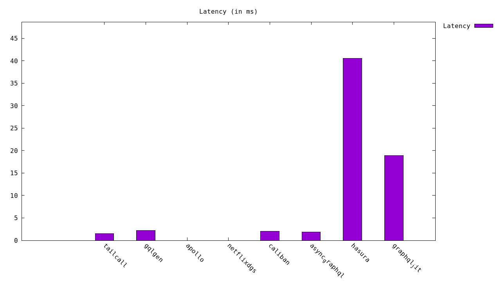

<!-- ⚠️⚠️⚠️ THIS FILE IS AUTO GENERATED DO NOT EDIT DIRECTLY ⚠️⚠️⚠️ -->

# GraphQL Benchmarks <!-- omit from toc -->

[](https://codespaces.new/tailcallhq/graphql-benchmarks)

Explore and compare the performance of the fastest GraphQL frameworks through our comprehensive benchmarks.

- [Introduction](#introduction)
- [Quick Start](#quick-start)
- [Benchmark Results](#benchmark-results)
  - [Throughput (Higher is better)](#throughput-higher-is-better)
  - [Latency (Lower is better)](#latency-lower-is-better)
- [Architecture](#architecture)
  - [WRK](#wrk)
  - [GraphQL](#graphql)
  - [Nginx](#nginx)
  - [Jsonplaceholder](#jsonplaceholder)
- [GraphQL Schema](#graphql-schema)
- [Contribute](#contribute)

[Tailcall]: https://github.com/tailcallhq/tailcall
[Gqlgen]: https://github.com/99designs/gqlgen
[Apollo GraphQL]: https://github.com/apollographql/apollo-server
[Netflix DGS]: https://github.com/netflix/dgs-framework
[Caliban]: https://github.com/ghostdogpr/caliban
[async-graphql]: https://github.com/async-graphql/async-graphql
[Hasura]: https://github.com/hasura/graphql-engine
[GraphQL JIT]: https://github.com/zalando-incubator/graphql-jit

## Introduction

This document presents a comparative analysis of several renowned GraphQL frameworks. Dive deep into the performance metrics, and get insights into their throughput and latency.

> **NOTE:** This is a work in progress suite of benchmarks, and we would appreciate help from the community to add more frameworks or tune the existing ones for better performance.

## Quick Start

Get started with the benchmarks:

1. Click on this [link](https://codespaces.new/tailcallhq/graphql-benchmarks) to set up on GitHub Codespaces.
2. Once set up in Codespaces, initiate the benchmark tests:

```bash
./setup.sh
./run_benchmarks.sh
```

## Benchmark Results

<!-- PERFORMANCE_RESULTS_START -->


Query: `
    {
      "operationName": null,
      "variables": {},
      "query": "{posts{id,userId,title,user{id,name,email}}}"
    }
    `

| Server         | Requests/sec | Latency (ms) | Relative |
| -------------- | ------------ | ------------ | -------- |
| Tailcall       | `88,929.36`  | `1.12`       | `40.28x` |
| Netflix DGS    | `56,996.51`  | `0.00`       | `25.82x` |
| Apollo GraphQL | `52,527.60`  | `0.00`       | `23.79x` |
| async-graphql  | `35,682.22`  | `2.84`       | `16.16x` |
| Gqlgen         | `35,393.13`  | `2.82`       | `16.03x` |
| Caliban        | `25,941.48`  | `4.00`       | `11.75x` |
| Hasura         | `2,207.78`   | `45.56`      | `1.00x`  |

Query: `
    {
      "operationName": null,
      "variables": {},
      "query": "{posts{title}}"
    }
    `

| Server         | Requests/sec | Latency (ms) | Relative |
| -------------- | ------------ | ------------ | -------- |
| Tailcall       | `92,106.42`  | `1.08`       | `31.47x` |
| Apollo GraphQL | `55,214.49`  | `0.00`       | `18.87x` |
| Netflix DGS    | `54,845.37`  | `0.00`       | `18.74x` |
| async-graphql  | `38,675.54`  | `2.58`       | `13.21x` |
| Gqlgen         | `32,393.30`  | `3.09`       | `11.07x` |
| Caliban        | `31,239.34`  | `3.20`       | `10.67x` |
| Hasura         | `2,926.73`   | `34.22`      | `1.00x`  |

Query: `
    {
      "operationName": null,
      "variables": {},
      "query": "{greet}"
    }
    `

| Server         | Requests/sec | Latency (ms) | Relative |
| -------------- | ------------ | ------------ | -------- |
| async-graphql  | `114,666.64` | `0.87`       | `26.12x` |
| Tailcall       | `106,999.46` | `0.93`       | `24.37x` |
| Caliban        | `97,864.89`  | `1.01`       | `22.29x` |
| Gqlgen         | `75,084.98`  | `1.33`       | `17.10x` |
| Netflix DGS    | `57,460.51`  | `0.00`       | `13.09x` |
| Apollo GraphQL | `55,250.27`  | `0.00`       | `12.58x` |
| Hasura         | `4,390.62`   | `22.80`      | `1.00x`  |

<!-- PERFORMANCE_RESULTS_END -->


### 1. `{posts {title body user {name}}}`
#### Throughput (Higher is better)


#### Latency (Lower is better)


### 2. `{posts {title body}}`
#### Throughput (Higher is better)


#### Latency (Lower is better)


### 3. `{greet}`
#### Throughput (Higher is better)


#### Latency (Lower is better)



## Architecture


A client (`wrk`) sends requests to a GraphQL server to fetch post titles. The GraphQL server, in turn, retrieves data from an external source, `jsonplaceholder.typicode.com`, routed through the `nginx` reverse proxy.

### WRK

`wrk` serves as our test client, sending GraphQL requests at a high rate.

### GraphQL

Our tested GraphQL server. We evaluated various implementations, ensuring no caching on the GraphQL server side.

### Nginx

A reverse-proxy that caches every response, mitigating rate-limiting and reducing network uncertainties.

### Jsonplaceholder

The primary upstream service forming the base for our GraphQL API. We query its `/posts` API via the GraphQL server.

## GraphQL Schema

Inspect the generated GraphQL schema employed for the benchmarks:

```graphql
schema {
  query: Query
}

type Query {
  posts: [Post]
}

type Post {
  id: Int!
  userId: Int!
  title: String!
  body: String!
  user: User
}

type User {
  id: Int!
  name: String!
  username: String!
  email: String!
  phone: String
  website: String
}
```

## Contribute

Your insights are invaluable! Test these benchmarks, share feedback, or contribute by adding more GraphQL frameworks or refining existing ones. Open an issue or a pull request, and let's build a robust benchmarking resource together!
